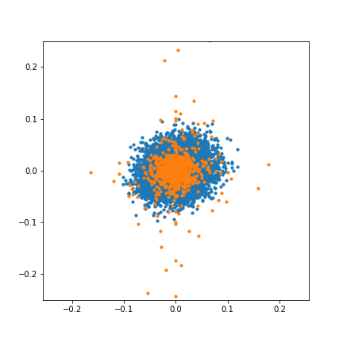
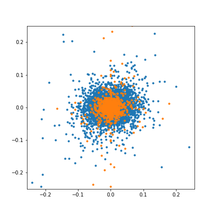
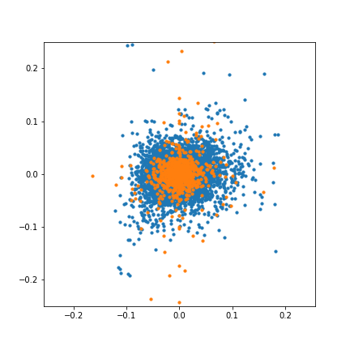
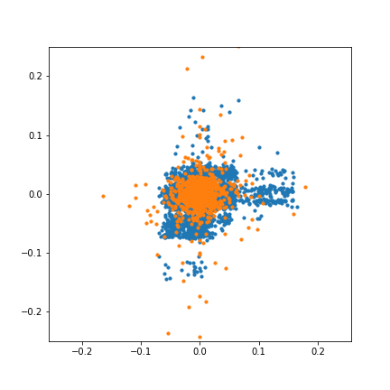

# Application of Generative Models for Risk Measurement in Commodity Trading
Course project, HSE

This repository contains ipynb notebooks and data sets for research on applacation of generative models for risk measurement in commodity trading. 

Considering models (blue points are generated, orange points are real):

<table>
<tr>
    <td></td>
    <td></td>
</tr>
<tr>
    <td>Geometric Brownian Motion (GBM)</td>
    <td>t copula with t marginals</td>
</tr>
<tr>
    <td></td>
    <td></td>
</tr>
<tr>
    <td>t copula with Gaussian KDE marginals</td>
    <td>Generative Adversarial Network (GAN)</td>
</tr>
</table>

Contents:
* [/report/main.pdf](report/main.pdf) — report on research
* [/generation_1](generation_1/) — first iteration of analysis, wide and shallow
* [/generation_2](generation_2/) — second iteration of analysis, specific and deep
